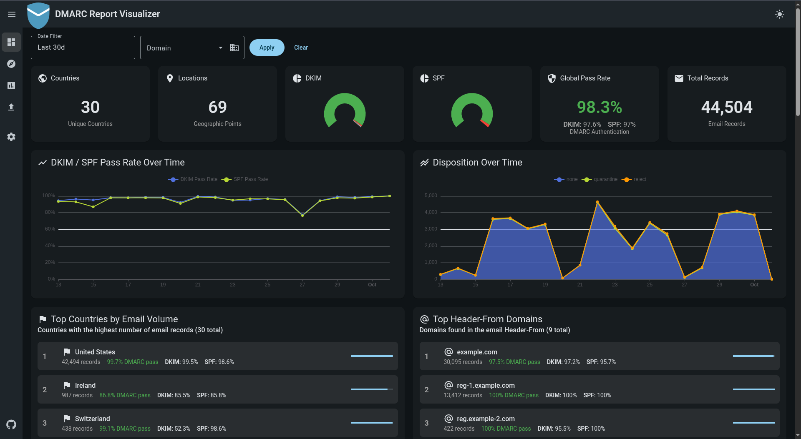

# DMARC Report Visualizer

<p align="center">
  
</p>

A web application to visualize DMARC reports, built with NestJS (backend) and Angular (frontend).

| Dashboard | Dashboard Map |
| --- | --- |
|  |  |

| Explore Reports | Report Raw XML |
| --- | --- |
|  |  |

## Quick Start

1) Copy the `.env.example` file to `.env` and adjust as needed

2) Download the docker images

    ```bash
    docker compose pull
    ```

3) Start the services

    ```bash
    docker compose up -d
    ```

    - Backend runs at `http://localhost:3000` or what is set in `.env`
    - Frontend runs at `http://localhost:80` or what is set in `.env`
    - Postgres runs at `localhost:5432` or what is set in `.env`

4) **Initial Setup**: On first launch, navigate to the frontend URL. You'll be automatically redirected to the setup page where you can create your initial administrator account.

## Features

- Visualize DMARC reports with interactive charts and maps
- Explore individual reports and view raw XML data
- Filter reports
- Upload reports via web interface
- Directory watcher to auto-import reports from a specified folder
- Gmail integration to download reports from email attachments
- Automatic database backups before migrations - See [BACKUP_SYSTEM.md](BACKUP_SYSTEM.md) for details

## Authentication

The application includes a secure authentication system to protect your DMARC data.

### Initial Setup

When you first access the application, you'll be prompted to create an administrator account:

1. Navigate to the frontend URL (default: `http://localhost:80`)
2. You'll be automatically redirected to `/setup`
3. Enter your email address and create a strong password
4. Password requirements:
   - Minimum 12 characters
   - At least one uppercase letter
   - At least one lowercase letter
   - At least one number
   - At least one special character (!@#$%^&*()-_+=?.,:;<>/)
5. Confirm your password and click "Create Account"
6. You'll be automatically logged in and redirected to the dashboard

### Login

After initial setup, access the application by:

1. Navigate to the frontend URL
2. Enter your email and password
3. Click "Login"

### Security Features

- **JWT-based authentication**: Secure token-based authentication with 15-minute access tokens
- **Refresh token rotation**: Automatic token refresh with rotation for enhanced security
- **Rate limiting**: Protection against brute-force attacks
  - 10 failed attempts per IP address within 5 minutes triggers a 15-minute lockout
  - 5 failed attempts per account within 5 minutes triggers a 15-minute account lock
- **Password security**: Bcrypt hashing with unique salts
- **Secure cookies**: HttpOnly, Secure, SameSite=Strict cookies for refresh tokens
- **Session management**: Automatic logout on password change across all devices

### Password Management

To change your password:

1. Click on your profile icon in the navigation bar
2. Navigate to "Profile" or "Settings"
3. Enter your current password
4. Enter your new password (must meet strength requirements)
5. Confirm your new password
6. Click "Change Password"

**Note**: Changing your password will invalidate all active sessions on all devices, requiring you to log in again.

### Environment Variables

The following environment variables control authentication behavior:

**Backend (`backend/.env`)**:
```bash
# JWT Configuration
JWT_SECRET=your-secret-key-here  # Generate with: openssl rand -base64 32
JWT_ACCESS_EXPIRATION=15m        # Access token lifetime
JWT_REFRESH_EXPIRATION=7d        # Refresh token lifetime

# Password Configuration
BCRYPT_ROUNDS=10                 # Bcrypt cost factor (higher = more secure but slower)

# Rate Limiting
RATE_LIMIT_IP_MAX_ATTEMPTS=10           # Max failed attempts per IP
RATE_LIMIT_IP_WINDOW_MS=300000          # IP rate limit window (5 minutes)
RATE_LIMIT_ACCOUNT_MAX_ATTEMPTS=5       # Max failed attempts per account
RATE_LIMIT_ACCOUNT_WINDOW_MS=300000     # Account rate limit window (5 minutes)
RATE_LIMIT_LOCK_DURATION_MS=900000      # Lock duration (15 minutes)

# Cookie Configuration
COOKIE_SECURE=false              # Set to true in production (requires HTTPS)
COOKIE_DOMAIN=localhost          # Set to your domain in production
```

**Frontend (`frontend/src/environments/environment.ts`)**:
```typescript
export const environment = {
  production: false,
  apiUrl: 'http://localhost:3000',
  tokenRefreshBuffer: 60000,  // Refresh token 1 minute before expiry
};
```

### Troubleshooting

#### Cannot access setup page
- **Problem**: Setup page redirects to login
- **Solution**: A user account already exists. Use the login page with existing credentials or reset the database if needed.

#### Locked out after failed login attempts
- **Problem**: "Account temporarily locked" or "Too many failed attempts" message
- **Solution**: Wait 15 minutes for the automatic unlock, or restart the backend service to clear in-memory rate limits (development only).

#### Token refresh failures
- **Problem**: Automatically logged out or "Session expired" errors
- **Solution**: 
  - Check that cookies are enabled in your browser
  - Verify `COOKIE_SECURE` is set to `false` for development (HTTP) or `true` for production (HTTPS)
  - Clear browser cookies and log in again
  - Check browser console for CORS errors

#### Password doesn't meet requirements
- **Problem**: Cannot create account or change password
- **Solution**: Ensure your password:
  - Is at least 12 characters long
  - Contains uppercase letters (A-Z)
  - Contains lowercase letters (a-z)
  - Contains numbers (0-9)
  - Contains special characters (!@#$%^&*()-_+=?.,:;<>/)

#### CORS errors in browser console
- **Problem**: Authentication requests fail with CORS errors
- **Solution**: 
  - Verify backend `CORS_ORIGIN` environment variable includes your frontend URL
  - Check that frontend `apiUrl` matches your backend URL
  - Ensure cookies are allowed for cross-origin requests if frontend and backend are on different domains

#### All sessions logged out unexpectedly
- **Problem**: Logged out across all devices
- **Solution**: This is expected behavior when:
  - Password is changed (security feature)
  - Backend service is restarted (in-memory tokens cleared)
  - Refresh tokens expire after 7 days of inactivity

#### Cannot log in after password change
- **Problem**: Password change succeeded but cannot log in with new password
- **Solution**: 
  - Wait a few seconds and try again (database sync)
  - Clear browser cache and cookies
  - Verify you're using the new password, not the old one

## IP Lookup Service

The IP Lookup Service enriches DMARC reports with geolocation data (country, city, ISP, organization) based on source IP addresses. It supports multiple providers with fallback mechanisms and rate limiting.
For detailed documentation, see [IP_LOOKUP.md](docs/IP_LOOKUP.md).
