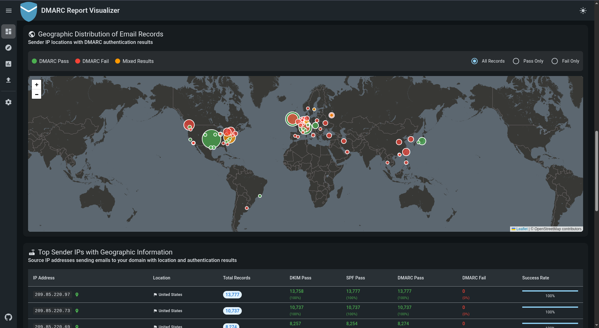

# DMARC Report Visualizer

<p align="center">
  
</p>

A web application to visualize DMARC reports, built with NestJS (backend) and Angular (frontend).

| Dashboard | Dashboard Map |
| --- | --- |
|  |  |

| Explore Reports | Report Raw XML |
| --- | --- |
|  |  |

## Quick Start

1) Copy the `.env.example` file to `.env` and adjust as needed

2) Download the docker images

    ```bash
    docker compose pull
    ```

3) Start the services

    ```bash
    docker compose up -d
    ```

    - Backend runs at `http://localhost:3000` or what is set in `.env`
    - Frontend runs at `http://localhost:80` or what is set in `.env`
    - Postgres runs at `localhost:5432` or what is set in `.env`

4) **Initial Setup**: On first launch, navigate to the frontend URL. You'll be automatically redirected to the setup page where you can create your initial administrator account.

## Features

- Visualize DMARC reports with interactive charts and maps
- Explore individual reports and view raw XML data
- Filter reports
- Upload reports via web interface
- Directory watcher to auto-import reports from a specified folder
- Gmail integration to download reports from email attachments
- Automatic database backups before migrations - See [BACKUP_SYSTEM.md](docs/BACKUP_SYSTEM.md) for details
- Authentication (username/password or SAML/SSO)

## IP Lookup Service

The IP Lookup Service enriches DMARC reports with geolocation data (country, city, ISP, organization) based on source IP addresses. It supports multiple providers with fallback mechanisms and rate limiting.
For detailed documentation, see [IP_LOOKUP.md](docs/IP_LOOKUP.md).
